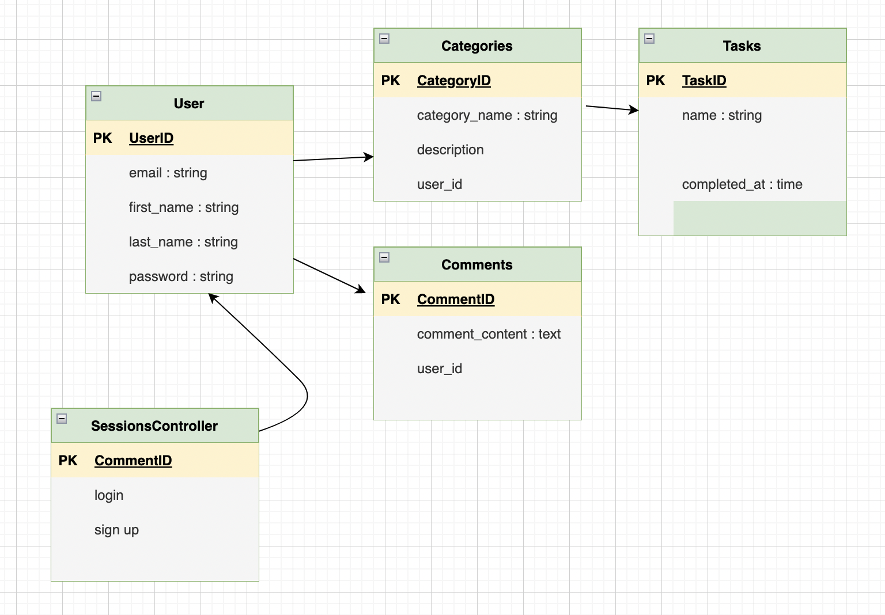
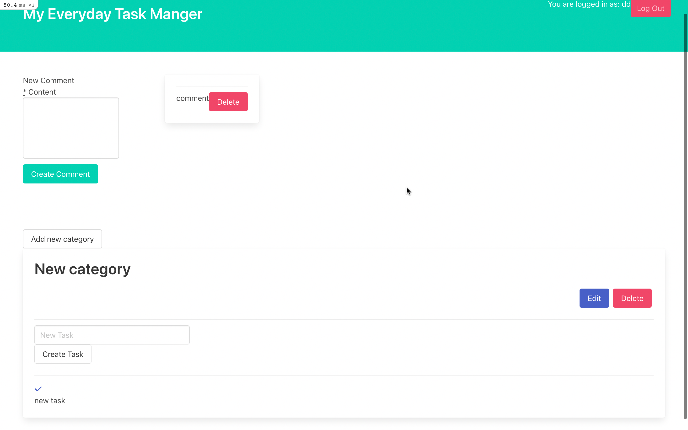
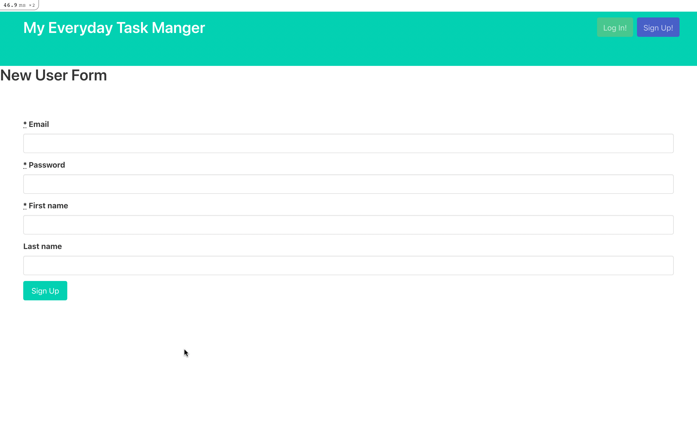

# Everyday Task Manager
### Ruby & Rails Project

(last updated : 16/11/22)
### 💻 Used Stacks 💻

## used gems 

* <a href="https://github.com/puma/puma">Puma</a>

Use Puma as the app server

* <a href="https://github.com/dhmgroup/bulmajs-rails">Bulma</a>

Bulma css

* <a href="https://github.com/heartcombo/simple_form">Simple Form</a>

* <a href="https://rspec.info/">Rspec</a>

* <a href="https://github.com/teamcapybara/capybara">Capybara</a>

Capybara system testing and selenium driver

#### It looks Like : 

#### MVC plan

<a href="https://www.figma.com/file/8yiNRP6MKV9rZUR8Hr4SFc/Ruby-On-Rails-Task-App?node-id=0%3A1&t=ybHd6CcWpknAF53s-0">Figma</a>

#### main page

#### sign up page

### 🗝 Key Skills 🗝
* Build a Ruby On Rails application from scratch
* Apply knowledge of (MCV)model, controller and view management
* Write unit tests